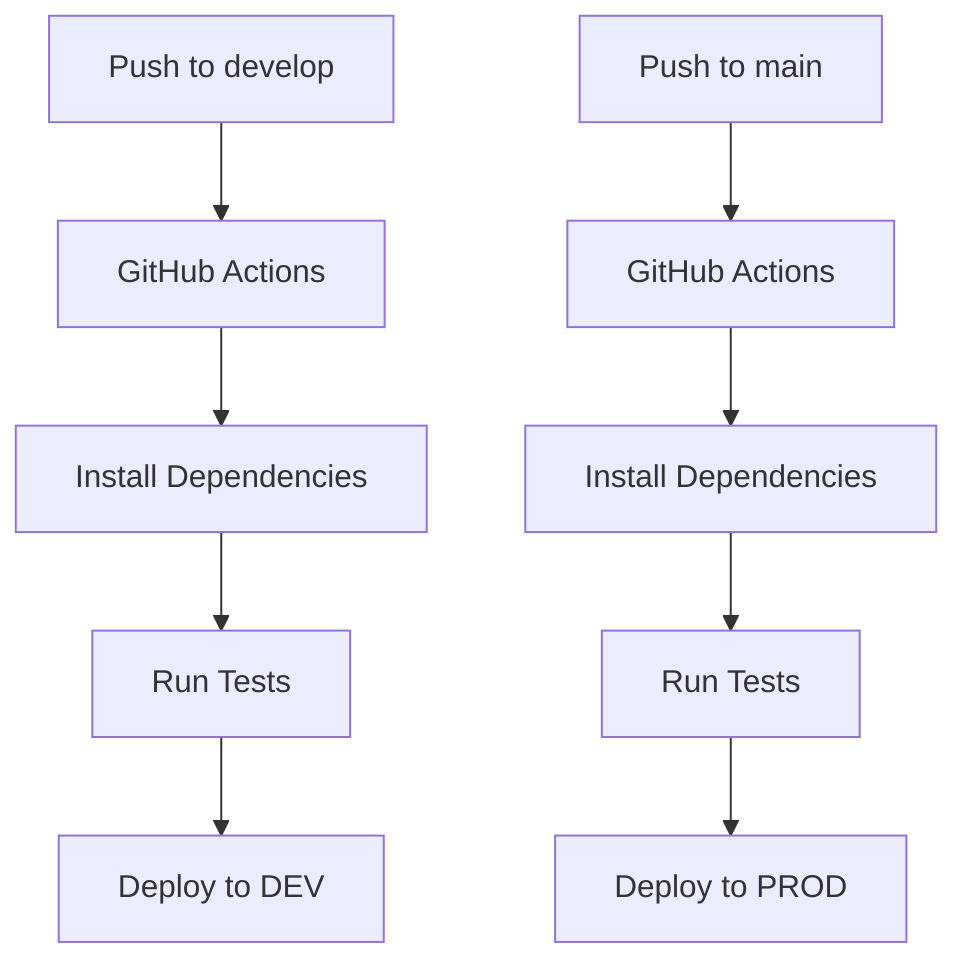

# 🔐 Configuración de GitHub Actions y Secrets

## 📋 Variables de Entorno y Secrets

### 🔧 Diferencias entre Local y GitHub Actions

| Ambiente | Configuración | Archivo |
|----------|---------------|---------|
| **Local** | `.env.dev` | Variables de entorno locales |
| **GitHub Actions** | `GitHub Secrets` | Variables encriptadas en GitHub |
| **Serverless** | `${env:VARIABLE, 'default'}` | Con valores por defecto |

## 🛠️ Configuración de GitHub Secrets

### 1. Ir a tu repositorio en GitHub
1. Ve a `Settings` → `Secrets and variables` → `Actions`
2. Haz clic en `New repository secret`

### 2. Configurar Secrets de AWS
```
AWS_ACCESS_KEY_ID=AKIA...
AWS_SECRET_ACCESS_KEY=...
AWS_REGION=us-east-1
```

### 3. Configurar Secrets para Desarrollo (DEV)
```
DEV_COGNITO_USER_POOL_ID=us-east-1_XXXXXXXX
```

### 4. Configurar Secrets para Producción (PROD)
```
PROD_COGNITO_USER_POOL_ID=us-east-1_YYYYYYYY
```

**Nota:** Las variables `AWS_REGION`, `STAGE` y `NODE_ENV` se configuran automáticamente:
- `AWS_REGION`: Se hereda del secret configurado para AWS
- `STAGE`: Se define automáticamente según el ambiente (dev/prod)
- `NODE_ENV`: Se define automáticamente según el ambiente (development/production)

## 🚀 Workflow de Deploy

### 📊 Flujo de trabajo:



### 🔄 Triggers configurados:

- **Push a `develop`** → Deploy a **DEV**
- **Push a `main`** → Deploy a **PROD**
- **Pull Request** → Solo tests (no deploy)

## 📝 Configuración del serverless.yml

### ✅ Formato compatible con GitHub Actions:

```yaml
environment:
  COGNITO_USER_POOL_ID: ${env:COGNITO_USER_POOL_ID, ''}
  AWS_REGION: ${env:AWS_REGION, 'us-east-1'}
  STAGE: ${env:STAGE, 'dev'}
  NODE_ENV: ${env:NODE_ENV, 'development'}
```

### ❌ Formato que NO funciona en GitHub Actions:

```yaml
environment:
  COGNITO_USER_POOL_ID: ${env:COGNITO_USER_POOL_ID}  # Sin valor por defecto
```

## 🏗️ Archivos de Configuración

### 📁 Estructura de archivos:

```
├── .env.dev              # Variables locales para desarrollo
├── .env.prod             # Variables locales para producción
├── .github/
│   └── workflows/
│       └── deploy.yml    # Workflow de GitHub Actions
└── serverless.yml        # Configuración con valores por defecto
```

## 🔐 Seguridad

### ✅ Buenas prácticas:

1. **Nunca** subir archivos `.env` al repositorio
2. **Usar GitHub Secrets** para variables sensibles
3. **Valores por defecto** no sensibles en serverless.yml
4. **Diferentes secrets** para DEV y PROD

### 📋 .gitignore actualizado:

```gitignore
# Environment variables
.env
.env.local
.env.dev
.env.prod
.env.*.local

# Build cache
.esbuild/

# Serverless
.serverless/
```

## 🧪 Testing Local vs GitHub Actions

### 🏠 Local (usando .env.dev):
```bash
npm run start          # Desarrollo local
npm run deploy:dev     # Deploy manual a DEV
```

### 🌐 GitHub Actions (usando Secrets):
```bash
git push origin develop  # Auto-deploy a DEV
git push origin main     # Auto-deploy a PROD
```

## 🔧 Comandos útiles

### 📦 Scripts de package.json:
```json
{
  "scripts": {
    "deploy:dev": "sls deploy --stage dev",
    "deploy:prod": "sls deploy --stage prod",
    "info:dev": "sls info --stage dev",
    "info:prod": "sls info --stage prod"
  }
}
```

### 🔍 Verificar deployment:
```bash
# Ver información del deployment
npm run info:dev
npm run info:prod

# Ver logs
sls logs -f getFusionados --stage dev --tail
```

## 📊 Variables de Entorno Utilizadas

### 🔄 Variables realmente utilizadas en el código:

- `COGNITO_USER_POOL_ID`: ID del User Pool de Cognito
- `AWS_REGION`: Región de AWS
- `STAGE`: Ambiente de despliegue (dev/prod)
- `NODE_ENV`: Modo de Node.js (development/production)

Después del primer deploy, obtén los IDs:

```bash
# Obtener User Pool ID
aws cognito-idp list-user-pools --max-items 10

# Obtener Client ID (si es necesario en el futuro)
aws cognito-idp list-user-pool-clients --user-pool-id YOUR_USER_POOL_ID
```

Luego actualiza los GitHub Secrets con los valores reales.

## 🚨 Troubleshooting

### ❌ Error común: "Cannot read environment variable"
**Solución**: Asegúrate de que el secret esté configurado en GitHub

### ❌ Error común: "Access denied"
**Solución**: Verifica que AWS_ACCESS_KEY_ID y AWS_SECRET_ACCESS_KEY estén configurados

### ❌ Error común: "Invalid stage"
**Solución**: El stage se determina automáticamente por la rama

---

🎉 **¡Configuración lista para GitHub Actions!**
